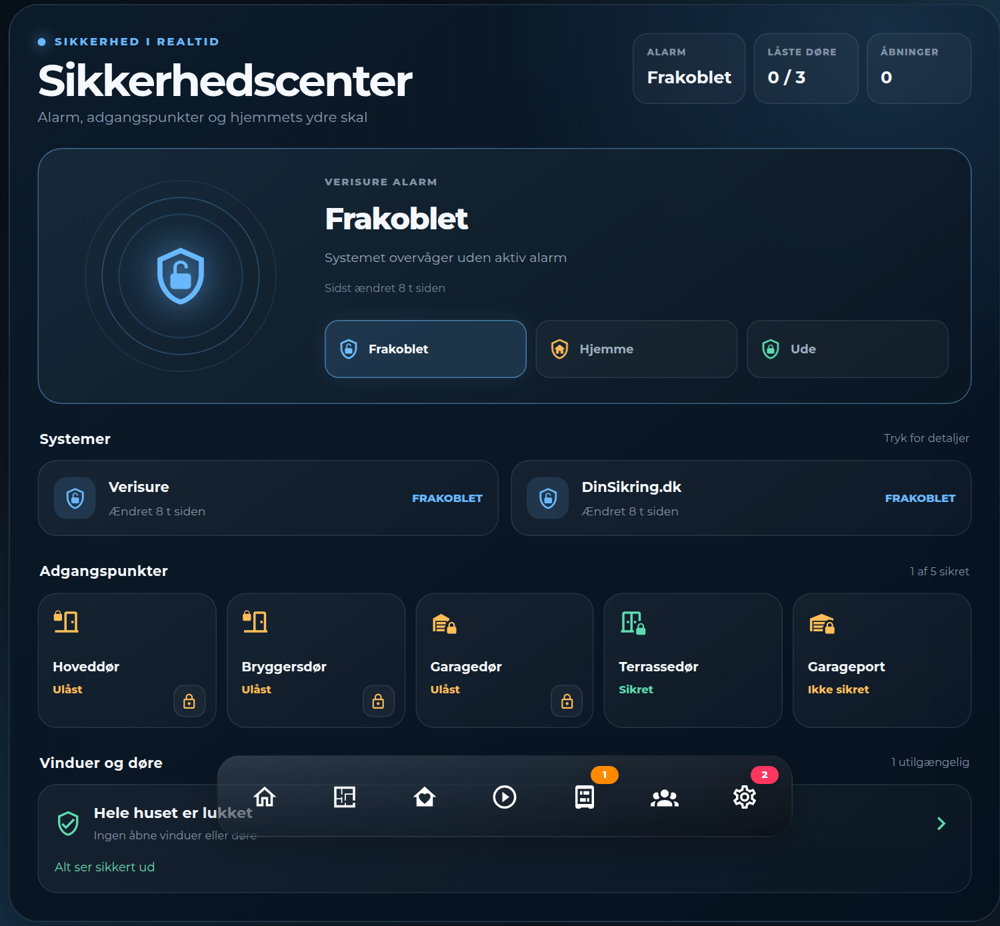

# HA Security Center Card



A Home Assistant Lovelace card that pulls the whole security picture into
one view: alarm state with a "radar" hero and one-tap arm/disarm shortcuts,
a systems row (useful if you run more than one alarm provider), a lock and
contact-sensor grid, and an open-windows/doors panel that links out to a
detailed view.

Works with any `alarm_control_panel`, `lock` and `binary_sensor` entities —
nothing is tied to a specific alarm brand or a fixed number of locks or
sensors.

Plain JavaScript, no build step — copy the file in and register it as a
dashboard resource.

> **Note:** the card's on-screen labels are currently Danish only. There's
> no built-in translation layer yet — fork the file and edit the label
> strings directly if you need another language.

## Installation

### HACS (custom repository)

1. In HACS, go to **Frontend** → the three-dot menu → **Custom repositories**.
2. Add `https://github.com/MRDonnii/ha-security-center-card` as type
   **Dashboard**.
3. Install **HA Security Center Card** and add the resource if HACS doesn't
   do it automatically.

### Manual

1. Download `ha-security-center-card.js` from the latest release (or this
   repo).
2. Copy it to
   `config/www/community/ha-security-center-card/ha-security-center-card.js`.
3. Add it as a dashboard resource:
   ```yaml
   url: /local/community/ha-security-center-card/ha-security-center-card.js
   type: module
   ```

## Usage

Add the card via the dashboard editor (search for "Security Center") or in
YAML:

```yaml
type: custom:ha-security-center-card
primary_alarm: alarm_control_panel.home
primary_alarm_name: Home alarm
actions:
  disarm: script.alarm_disarm
  home: script.alarm_arm_home
  away: script.alarm_arm_away
locks:
  - entity: lock.front_door
    name: Front door
  - entity: lock.back_door
    name: Back door
contacts:
  - entity: binary_sensor.garage_door_contact
    name: Garage door
openings:
  - entity: binary_sensor.living_room_window
    name: Living room window
  - entity: binary_sensor.bedroom_window
    name: Bedroom window
openings_path: /lovelace/security
```

Only `primary_alarm` is meaningfully required — everything else defaults to
empty and simply doesn't render (arm/disarm buttons show disabled without
matching `actions`, the secondary-alarm row is hidden without
`secondary_alarm`).

Add a second alarm system (e.g. a separate monitored-alarm subscription
alongside a local `alarm_control_panel`) with `secondary_alarm` /
`secondary_alarm_name`.

## Configuration reference

| Key | Description |
|---|---|
| `primary_alarm` | `alarm_control_panel` entity (required) |
| `primary_alarm_name` | Label shown for the primary alarm (default `Alarm`) |
| `secondary_alarm` | Optional second `alarm_control_panel` entity — the systems row only shows it when set |
| `secondary_alarm_name` | Label for the secondary alarm (default `Alarm 2`) |
| `actions.disarm` / `actions.home` / `actions.away` | `script` entity called when the matching mode button is pressed — a mode button without a matching action renders disabled |
| `locks` | List of `{entity, name, icon}` — shown in the access grid with a tap-to-toggle lock/unlock button |
| `contacts` | List of `{entity, name, icon}` — `binary_sensor` shown as secured/not-secured, no toggle |
| `openings` | List of `{entity, name}` — `binary_sensor` entities checked for open windows/doors; only the currently-open ones are listed |
| `openings_path` | Dashboard path to navigate to when the open-panel is tapped — the panel isn't clickable if omitted |

Tapping a lock's action button toggles it directly; tapping anywhere else
on a lock/contact tile, or a system row, opens that entity's more-info
dialog.

## License

MIT — see [LICENSE](LICENSE).
The visual card editor provides entity pickers for alarms and scripts plus
add/remove controls for locks, contacts, windows and doors.
